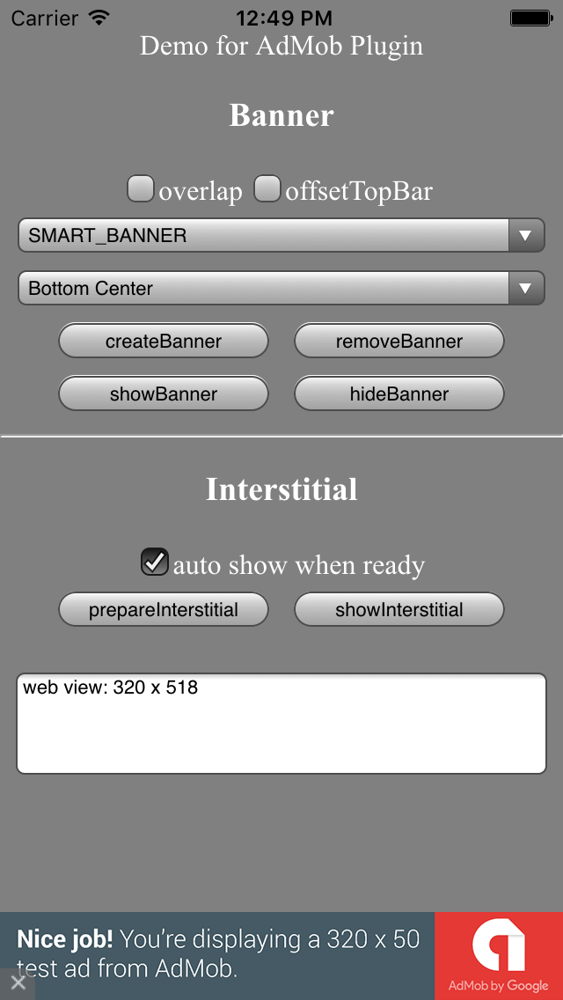

AdMob Demo for Intel XDK and Apache Cordova Project
==========================================

See [LICENSE.md](<LICENSE.md>) for license terms and conditions.

Project File Information
------------------------

The `icon.png` and `screenshot.png` files are not required by your project. They
are included for use by the Intel XDK template/demo panel and have no use within
a real app. You can safely delete them from your project directory.

The `cordova.js` script is needed to provide your app with access to Cordova
APIs. To add Cordova APIs to your application you must add the corresponding
Cordova plugins. See the *Plugins* section on the **Projects** tab.

Project Details
---------------

This Demo project as a starting point for an Intel XDK or Apache Cordova hybrid
mobile app. One key file (`init-dev.js`) contains the initialization code needed
to handle Intel XDK device ready, Cordova device ready or browser document ready
init events in a way that allows you to run your app in any of these
environments. This init code works:

-   with the the Intel XDK Emulate tab

-   in the Intel XDK App Preview application (Test tab)

-   in the App Preview Crosswalk container (Debug tab)

-   with the weinre debug script (Test tab)

-   in an app built using the Intel XDK legacy container (aka AppMobi container)

-   in an app built using the standard Apache Cordova container (aka Cordova
    CLI)

When `init-dev.js` completes execution it issues a custom "`app.Ready`" event.
Use this event to start your application, rather than waiting on "device ready"
or "document ready" or "window load" or similar events. You should not have to
modify anything in `init-dev.js` to use this code. Also, `init-dev.js` has been
written so that it is not dependent on any external libraries or specific
webviews. It has been tested with the following webviews and browsers:

See js/admob.js for details about calling admob plugin APIs, then call initAdMob() 
in "`app.Ready`" event.

Screenshot
---------------

